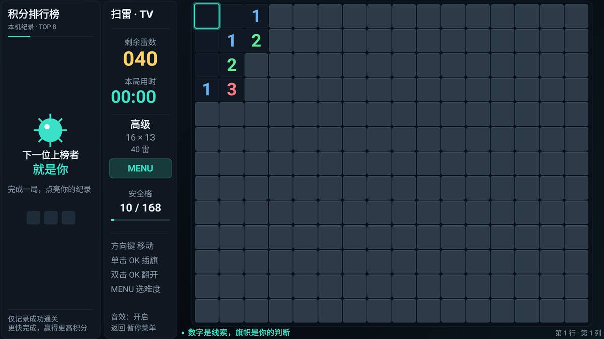

# TVMinesweeper · 电视扫雷

面向 Android TV / 电视盒子的经典扫雷游戏，采用纯 Java 与原生 Android Framework。支持 Android 4.3（API 18）及以上系统，无 AndroidX、Kotlin、网络权限或原生动态库。



## 开始游戏

安装 `release` 目录中的最新 `TVMinesweeper-release-版本号.apk` 后启动「电视扫雷」。方向键移动光标，单击 OK 插旗或取消旗帜，双击 OK 翻开格子。首次翻开位置及周围八格安全。

| 按键 | 功能 |
| --- | --- |
| 方向键 | 移动光标，边界不绕回 |
| OK / Enter 单击 | 插旗 / 取消旗帜 |
| OK / Enter 双击 | 翻开格子；对数字格执行快速展开 |
| MENU / 设置键 | 打开或关闭难度、音效和帮助菜单 |
| 键盘 M / F1 | 打开或关闭同一个菜单 |
| 返回 / Esc | 打开暂停菜单：继续游戏、选择难度、保存并退出；弹层中关闭当前弹层 |

双击间隔不超过 360ms，单击在约 361ms 后执行。菜单、结算和暂停界面只需单击确认；结算刚出现时会忽略残余连按，避免误开下一局。查看已结束棋盘时，单击 OK 立即再开一局。音量键保持系统正常调节。

实体遥控器 MENU 没有反应时，可用备用入口：**返回 → 下键选“选择难度” → OK → 上下选择难度 → OK**。返回菜单默认选择“继续游戏”，直接按 OK 就能回到原局；进入难度菜单后按返回取消不会换局。

## 游戏功能

五档难度由易到难递进，雷数范围包含上下限：

| 难度 | 棋盘（列 × 行） | 每局雷数 |
| --- | ---: | ---: |
| 初级 | 9 × 9 | 10–15 |
| 中级 | 12 × 10 | 18–24 |
| 高级 | 16 × 13 | 34–44 |
| 困难 | 20 × 16 | 58–72 |
| 挑战 | 24 × 19 | 90–108 |

- 每个新局只抽取一次雷数，首次翻开、暂停和存档恢复都保持本局雷数；新局可能抽到与上一局相同的数量。
- 左侧排行榜、相邻信息栏、右侧大棋盘，整屏外边距为实际 2 像素。五档新局均以大方格纵向铺满棋盘可用高度，排行榜中的日期与用时同行显示。
- 深色背景、青绿色光标和彩色数字；剩余雷数、用时、难度和操作提示集中在信息栏。
- 首步安全、连片展开、数字快开、错旗提示和结算后查看棋盘。翻开所有安全格即可获胜。
- 仅记录真实胜利的本地前八名，五档积分权重依次为 1、2、3、5、8。旧中级和高级记录分别对应新高级和挑战，历史分数保持不变。
- 自动保存棋盘、本局雷数、光标、难度和音效设置；升级时保留旧局尺寸与雷数，旧宽棋盘纵向拉高铺满。返回应用后确认继续，暂停时间不计入用时。
- 移动、翻开、插旗、撤旗、菜单、胜利和失败七种原创短音效，可关闭。
- 默认中文，英文系统自动显示英文；兼容触摸辅助操作。

## 文档与构建

- [完整使用帮助](docs/使用帮助.md)
- [构建与发布说明](docs/构建说明.md)
- [实现说明](docs/实现说明.md)
- [验证记录](docs/验证记录.md)
- [原始开发规范](docs/deepseek_markdown_20260919_7d102a.md)
- [HTML 原型](docs/deepseek_html_20260919_91e594.html)

原始规范和原型保留为历史输入；当前操作、随机雷数与布局以本说明、使用帮助及应用内提示为准。

```powershell
powershell -ExecutionPolicy Bypass -File tools/build-release.ps1
```

脚本执行 JUnit、release Lint、R8 混淆、签名与构建，自动增加版本号，并把 APK 放入根目录 `release`。项目没有 `.so`，交付单个可在 arm64 设备运行的纯 Java APK，不另行构建其他 ABI 版本。

设备回归可运行 `tools/verify-device.ps1`，会重开测试对局，默认保留排行榜；只有显式 `-ResetData` 才会清除应用数据。回归读取无障碍文本，不截图，报告与临时 XML 均放在 `E:\temp\TVMinesweeper`。新局测试通过返回菜单逐一检查五档雷数与边界，并检查挑战局第 19 行光标的存档恢复；同时保留独立的 MENU / M / F1 兼容检查。实际验证结果以验证记录和脚本报告为准。

代码只使用 Git `main` 主分支管理。所有 Markdown 文件统一 LF 换行，签名私钥和本机构建缓存不提交。
