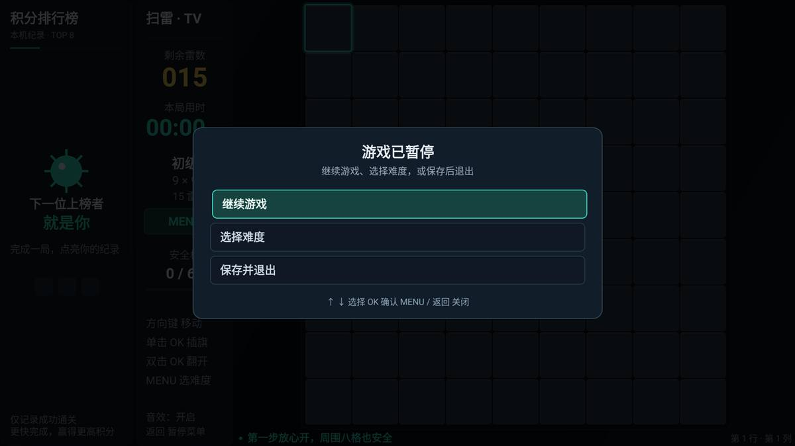

# TVMinesweeper 使用帮助

TVMinesweeper 是适合电视遥控器操作的经典扫雷游戏。画面从左到右依次为积分排行榜、信息栏和大棋盘。剩余雷数、用时、难度和操作提示集中在信息栏，排行榜中的日期与用时在同一行显示。五档新局都用大方格纵向铺满棋盘可用高度，方便在电视前辨认数字和当前落点。

游戏支持 Android 4.3 及以上系统，横屏运行，无需联网，不申请网络等权限。

## 安装和启动

1. 在项目根目录的 `release` 文件夹找到最新的 `TVMinesweeper-release-版本号.apk`。
2. 将 APK 复制到电视或电视盒子，使用设备文件管理器安装。开发调试也可执行 `adb install -r APK文件路径`。
3. 在电视应用列表中打开“电视扫雷”。首次启动使用初级难度，光标位于棋盘左上角。

APK 不包含原生 `.so` 库，不需要额外的 ABI 安装包。覆盖安装会保留本机设置、排行榜和已保存进度；卸载或清除应用数据会删除这些内容。

## 遥控器操作

| 按键 | 棋盘中的作用 |
| --- | --- |
| 上、下、左、右 | 移动高亮光标，棋盘边缘不会绕回 |
| OK / 确认键单击 | 给未翻开的格子插旗，再次单击取消旗帜 |
| OK / 确认键双击 | 翻开当前格子；对已翻开的数字格执行快速展开 |
| MENU / 菜单键 | 打开或关闭难度和设置菜单 |
| 返回键 | 打开“游戏已暂停”菜单；有弹层时关闭当前弹层 |

双击的两次按下需要在 360 毫秒内完成。为区分单击和双击，单击插旗会等待约 361 毫秒。长按 OK 只产生一次单击，不会不断切换旗帜；移动光标或打开菜单会取消尚未执行的单击。

键盘调试时，Enter 对应 OK，M 或 F1 打开菜单，Esc 对应返回。设备的设置键也可打开菜单，前提是系统允许按键传入应用。音量键保持电视或盒子的正常音量调节。

手柄 A 对应 OK，X 即时插旗或取消，Start 打开菜单，B 返回。

难度菜单、帮助、结算和暂停菜单中的 OK 单击确认所选项，不需要双击。结算刚出现时会短暂忽略残余连按，避免误开下一局。返回应用后的暂停提示也只需按一次 OK 继续；这次确认不会额外插旗或翻格。

## 三分钟学会扫雷

1. 用方向键选择一个格子，双击 OK 翻开。第一次翻开的位置以及周围八格没有地雷；边缘以实际存在的相邻格子为准。
2. 数字表示周围八格中地雷的数量。空白格周围没有雷，会自动展开相连的安全区域。
3. 推断某个未翻开的格子有雷时，单击 OK 插旗。旗帜会保护该格，双击不会翻开它；需要先单击取消旗帜，再双击翻开。
4. 一个已翻开的数字格周围旗帜数等于该数字时，双击这个数字格可以一次翻开其余相邻格子。请先确认旗帜位置正确，错误插旗可能在快速展开时踩雷。
5. 翻开全部没有地雷的格子即为通关，不要求给所有地雷插旗。翻开任意地雷则本局结束。

“剩余雷数”是本局地雷总数减去旗帜数量。旗帜只是你的判断，不代表系统确认那里有雷。最多可放置与本局雷数相同数量的旗帜；剩余雷数为零时，需先取消一面旗帜才能在其他位置插旗。

## 每局随机雷数

| 难度 | 棋盘尺寸（列 × 行） | 每局地雷数范围 | 适合 |
| --- | ---: | ---: | --- |
| 初级 | 9 × 9 | 10–15 | 熟悉规则和遥控器操作 |
| 中级 | 12 × 10 | 18–24 | 逐步增加推理范围 |
| 高级 | 16 × 13 | 34–44 | 挑战更复杂的数字关系 |
| 困难 | 20 × 16 | 58–72 | 练习大棋盘规划 |
| 挑战 | 24 × 19 | 90–108 | 挑战完整大局与通关速度 |

每个新局从对应范围内抽取一个整数作为本局雷数，上下限均包含在内。确定后整局不变；插旗、首次翻开、打开菜单、暂停或恢复存档都不会重新抽取。新局可能抽到与上一局相同的雷数，这是正常情况。

信息栏显示当前局的实际雷数和剩余雷数；难度菜单显示该难度的雷数范围。雷的位置在首次翻开时生成，确保首次翻开区域安全。

## 升级与原有进度

上表是五档新局的参数。升级后，尚未结束的旧对局仍保留原棋盘尺寸、地雷数、已翻开格、旗帜、用时和光标，不会被替换为新局：

| 旧版难度 | 升级后显示 | 继续旧局时的棋盘 |
| --- | --- | --- |
| 初级 | 初级 | 原 9 × 9 棋盘与雷数 |
| 中级 | 高级 | 原 16 × 16 棋盘与雷数 |
| 高级 | 挑战 | 原 30 × 16 棋盘与雷数 |

旧宽棋盘也会纵向铺满可用高度，格子可能略呈竖向长方形；新开五档对局使用大方格。确认重新开局后，才使用新难度对应的尺寸和随机雷数范围。

历史排行榜同步调整难度名称：旧初级、中级、高级分别显示为初级、高级、挑战，已有积分保持原值，不重新计算。覆盖安装即可保留这些记录，卸载或清除应用数据会删除它们。
## 难度、音效和帮助

在棋盘上需要选择难度时，可使用返回键入口：**返回 → 下键选“选择难度” → OK → 上下选择难度 → OK**。实体遥控器的 MENU 键无响应时也可以这样操作。

返回键显示“游戏已暂停”菜单，选项依次为“继续游戏”“选择难度”“保存并退出”，默认选中“继续游戏”。直接按 OK 可继续原局，选择“选择难度”后会打开现有的难度、音效和帮助菜单。仅进入这个菜单不会重开；按返回取消仍保留当前棋盘、雷数、光标和累计用时。



也可按 MENU（键盘 M / F1）直接打开难度菜单，用上下方向键选择，按一次 OK 确认。鼠标或触屏也可以点击信息栏中的难度区域或 MENU 按钮。菜单打开期间暂停计时，再按 MENU、M、F1 或返回键关闭，光标保持原位置。

确认任一难度都会立即开始该难度的新局并替换当前棋盘；选择相同难度也会重新开局和抽取雷数。只想返回当前对局时，请选择“继续游戏”，或关闭菜单。

菜单提供音效开关和玩法帮助。音效包括移动、翻开、插旗、取消旗帜、菜单、通关和踩雷的短提示音，不循环播放背景音乐。关闭音效会停止当前声音，并保存设置供下次启动使用。

## 暂停、继续和结束

- 打开难度菜单、暂停菜单或切到其他应用时，游戏暂停计时；进入后台时停止音效。
- 返回应用后，按一次 OK 继续，暂停期间不会累计用时。
- 游戏保存棋盘、本局雷数、累计用时和光标位置。正常退出后再次打开，可继续已保存的未结束对局。
- 通关或踩雷后显示结算面板。选择“再来一局”会开始同难度的新局并重新抽取雷数；选择“查看棋盘”可检查结果。
- 查看已结束棋盘时，方向键移动，单击 OK 立即再开一局；返回 → 选择难度或 MENU / M / F1 可重新选择难度。
- 返回键打开“游戏已暂停”菜单，默认选中“继续游戏”；向下选择“选择难度”可进入难度菜单，继续向下选择“保存并退出”才会关闭应用。

## 积分排行榜

排行榜仅保存本机真实通关的前八名，不含演示数据。失败或未完成的对局不计入排行榜。进入前八名的新成绩会高亮提示。

```text
积分 = 四舍五入（难度权重 × 10000 ÷ 通关用时秒数）
```

初级、中级、高级、困难、挑战的难度权重分别为 1、2、3、5、8，不足一秒按一秒计算。同难度下用时越短，积分越高；本局随机雷数不另加权。积分相同时优先用时较短的成绩，用时也相同时优先最近完成的成绩。

菜单和后台暂停时间不计入通关用时。条目显示积分、难度、日期和用时，仅保存在本设备，不会上传。

## 常见问题

**单击 OK 为什么稍等一下才插旗？**

游戏需要等待 360 毫秒的双击判定窗口，避免双击翻开时先误插旗。单击约在 361 毫秒后执行。

**为什么双击 OK 没有翻开？**

先确认当前格没有旗帜；有旗帜时先单击取消。两次按下也需要在 360 毫秒内完成。已翻开的数字格只有在周围旗帜数匹配时才能快速展开。

**为什么同一个难度每局的雷数不同？**

每个新局会在该难度规定范围内抽取一次雷数，使棋局更有变化。当前局不会自行改变雷数，存档恢复也会保留它。

**遥控器菜单键没有反应怎么办？**

直接按返回键，按下键选中“选择难度”，按 OK 进入，再用上下键选择难度并按 OK 确认。只想返回原局时，进入难度菜单后再按返回即可。键盘仍可使用 M / F1，鼠标或触屏可点击信息栏的难度区域。

**没有音效怎么办？**

检查菜单的音效开关和电视媒体音量。刚启动时音频需要短暂加载，尚未加载完成的音效会被略过，不影响操作。

**左右方向键会移到排行榜吗？**

不会。排行榜和信息栏不抢占棋盘焦点，方向键始终在棋盘内部移动；选择难度直接打开菜单即可。

**电视边缘显示不完整怎么办？**

当前界面仅留实际 2 像素外边距，以便充分利用画面。如果电视开启过扫描而裁切边缘，请在电视显示设置中关闭过扫描，或选择“点对点”“原始尺寸”等模式。
